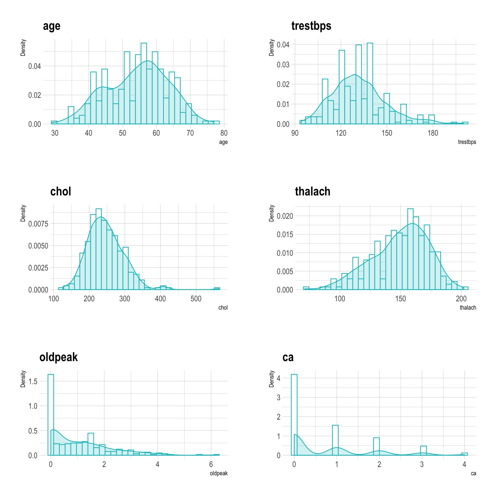

Heart Disease Classification
================
Jamie Hargreaves

## Loading the data

We’re going to use a [dataset taken from
Kaggle](https://www.kaggle.com/ronitf/heart-disease-uci) containing a
total of 13 physical attributes of patients relating to the likelihood
of heart disease, along with a variable indicating whether or not the
patient actually has heart disease.

``` r
library(tidyverse)

# get data 
data <- read_csv("heart.csv")
```

## Exploratory analysis

Let’s start to dig a little deeper into the data set:

``` r
# check the type of each column and for the number of NAs
tibble(
  colnames(data),
  map_chr(
    1:ncol(data),
    function(x){
      data[[x]] %>% typeof()
    }
  ),
  map_int(
    1:ncol(data),
    function(x){
      is.na(data[[x]]) %>% sum()
    }
  )
)
```

    ## # A tibble: 14 x 3
    ##    `colnames(data)` `map_chr(...)` `map_int(...)`
    ##    <chr>            <chr>                   <int>
    ##  1 age              double                      0
    ##  2 sex              double                      0
    ##  3 cp               double                      0
    ##  4 trestbps         double                      0
    ##  5 chol             double                      0
    ##  6 fbs              double                      0
    ##  7 restecg          double                      0
    ##  8 thalach          double                      0
    ##  9 exang            double                      0
    ## 10 oldpeak          double                      0
    ## 11 slope            double                      0
    ## 12 ca               double                      0
    ## 13 thal             double                      0
    ## 14 target           double                      0

``` r
# get number of observations
nrow(data)
```

    ## [1] 303

We can see that each of the 14 variables are numeric and that we have no
missing values in any of the 303 observations. Whilst all of the
variables have been identified as numeric, this doesn’t really make
sense since a number are actually integer representations of categorical
variables, for example, the chest pain type `cp` can take values of `0`,
`1`, `2`, or `3`, but a value of say `2.6` doesn’t really mean anything.
We therefore need to convert variables like this to factors:

``` r
library(magrittr)

# convert relevant variables to factors
data %<>%
  mutate(
    sex = as.factor(sex),
    cp = as.factor(cp),
    fbs = as.factor(fbs),
    restecg = as.factor(restecg),
    exang = as.factor(exang),
    slope = as.factor(slope),
    thal = as.factor(thal),
    target = as.factor(target)
  )
```

Let’s look at the distribution of age in the sample:

``` r
library(hrbrthemes)

# histograms
data %>%
  ggplot(aes(x = age, y = ..density..)) + 
  geom_histogram(bins = 50, colour = "orange2", fill = "white") + 
  geom_density(colour = "orange2", fill = "orange", alpha = 0.2) + 
  xlab("Age") + 
  ylab("Density") + 
  theme_ipsum()
```



We can see that the majority of the sample population are in their late
50s, though there’s also a peak around the mid-40s as well. We have a
`sex` variable so let’s see if there’s much difference between the
distribution of ages between sexes:

``` r
# boxplots
data %>%
  ggplot(aes(x = sex, y = age, colour = sex)) + 
  geom_boxplot(alpha = 0.3, show.legend = FALSE) + 
  geom_jitter(alpha = 0.3, show.legend = FALSE) + 
  coord_flip() + 
  scale_x_discrete(label = c("Female", "Male")) + 
  xlab(NULL) + 
  ylab("Age") + 
  theme_ipsum()
```


We can see from the box plots that there is a difference between the
distribution of male and female ages in the sample, in particular the
median age of male patients is slightly lower than that of female
pateints, and the male population looks to have a wider range of ages,
however the difference between the two don’t look to be particularly
drastic.

It’d be interesting to see the correlation between the various variables
in the data set:

``` r
library(ggcorrplot)

# correlation matrix
cor_mat <- data %>%
  select_if(is.numeric) %>%
  cor()

# significance of correlations
p.mat <- data %>%
  select_if(is.numeric) %>%
  cor_pmat()
  
# correlogram
data %>%
  select_if(is.numeric) %>%
  cor() %>%
  ggcorrplot(type = "lower", p.mat = p.mat)
```


## Training a model

Before we do anything, we’re going to write a function to train a model
using a given algorithm - the function will:

  - Randomly partition the data into train and test sets, allocating 70%
    of the data to train;

  - Train the specified model using repeated k-fold cross validation;

  - Predict on the test data using the model selected under cross
    validation; and

  - Return the final model, the predictions and the test data.

Under cross validation, we take the training set and randomly partition
it into *k* folds (or groups). We then select one fold to use as a
validation set and train a model on the remaining *k-1* folds. We repeat
the process, each time using a different fold as a validation set so
that in total, each fold is used once as a validation set and *k-1*
times as a training set. After this process, we end up with a total of
*k* models and we calculate the cross validated error by taking the
average over the errors of each individual model which provides us with
an estimate of the true error. Since we’re using *repeated* *k*-fold
cross validation, we then repeat the process *N* times and take the
final cross validated error to be the average of each of the individual
cross validated errors - we’ll take *k* = 10 and *N* = 5. This gives us
a robust way to compare the accuracy of different types of
models.

``` r
predict_class <- function(data, response, predictors, model_type, family = NULL){
  # split the data into test and train, with 70% train
  train_index <- createDataPartition(data[[response]], p = 0.7, list = FALSE)
  train_data <- data[train_index, ]
  test_data <- data[-train_index, ]
  
  # create a formula from the response and predictors
  predictors <- paste(predictors, collapse = "+")
  formula <- as.formula(paste(response, "~", predictors))
  
  # train the model
  ctrl <- trainControl(method = "repeatedcv", number = 10, repeats = 5)
  model <- train(formula, data = train_data, method = model_type, 
                 family = family, trControl = ctrl)
  
  # run the model on the test data
  prediction <- model %>%
    predict(test_data)
  
  results <- list("model" = model, "prediction" = prediction, "test_data" = test_data)
  return(results)
}
```

## Multiple logistic regression

We’ve now got our data set in a format that’s suitable for modelling.
This is a binary classification problem since, given the set of patient
attributes, we want to answer the question “does the patient have heart
disease?”. The simplest method (and the method we’ll try first), is
multiple logistic regression, so let’s talk a little about how it works.

With a typical regression model we’re trying to predict the value of a
continuous response variable, for example, a person’s salary given their
age and the number of years they spent in higher education. In this case
it’s completely reasonable get a prediction of say `27,836.89`. However,
for the same reason that we encoded some of the variables in the data
set as factors previously, it makes no sense if our model were to
predict a value of `0.768` in response to the question of whether or not
a person has heart disease - they either do or they don’t.

With multiple logistic regression, rather than predicting a `0` or a
`1`, we predict the probability that an observation belongs to one of
the categories. We could use multiple linear regression to model this
probability, but this approach suffers from the fact that we could
return probabilities that were either less than `0` or greater than `1`,
and these probabilities would be essentially meangingless. Multiple
logistic regression avoids this problem by constraining all predictions
to the interval \[0,1\].

We’ll use the `caret` library and the function we wrote above to train a
multiple logistic regression model. In general if we don’t have any
domain knowledge which suggests that all the features in our data set
should be important in our model, then we might want to find an optimal
feature set, but since we have good reason to believe that each of the
features in the data set are indicators of heart disease, we’ll proceed
to use them all.

``` r
library(caret)
set.seed(100)

# train the model
model_log <- predict_class(
  data = data,
  response = "target",
  predictors = ".",
  model_type = "glm",
  family = "binomial"
)

# check the accuracy
model_log$model
```

    ## Generalized Linear Model 
    ## 
    ## 213 samples
    ##  13 predictor
    ##   2 classes: '0', '1' 
    ## 
    ## No pre-processing
    ## Resampling: Cross-Validated (10 fold, repeated 5 times) 
    ## Summary of sample sizes: 192, 191, 191, 192, 192, 192, ... 
    ## Resampling results:
    ## 
    ##   Accuracy   Kappa    
    ##   0.8359524  0.6687658

We can see from the above results that the multiple logistic regression
model has an accuracy of roughly 84% which is impressive for such a
simple model\! Let’s see which of the features were most influential by
looking at the variable importance score:

``` r
# plot
varImp(model_log$model) %>%
  ggplot(aes(x = rownames(), y = Overall)) + 
  geom_col(colour = "orange2", fill = "white") + 
  coord_flip() + 
  xlab(NULL) +
  ylab("Variable Importance Score") + 
  theme_ipsum()
```


