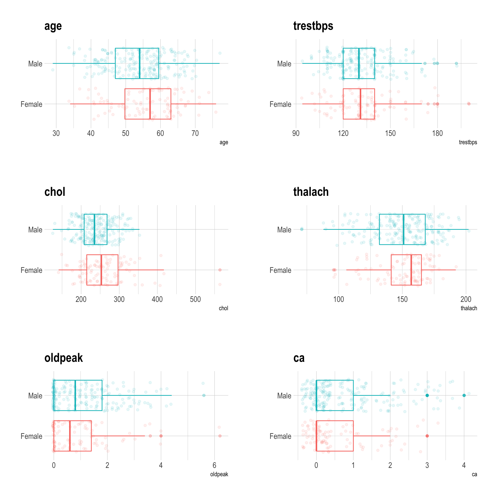
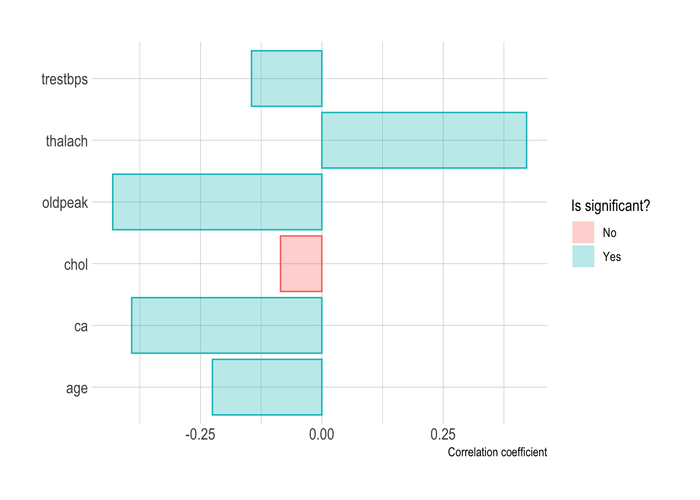
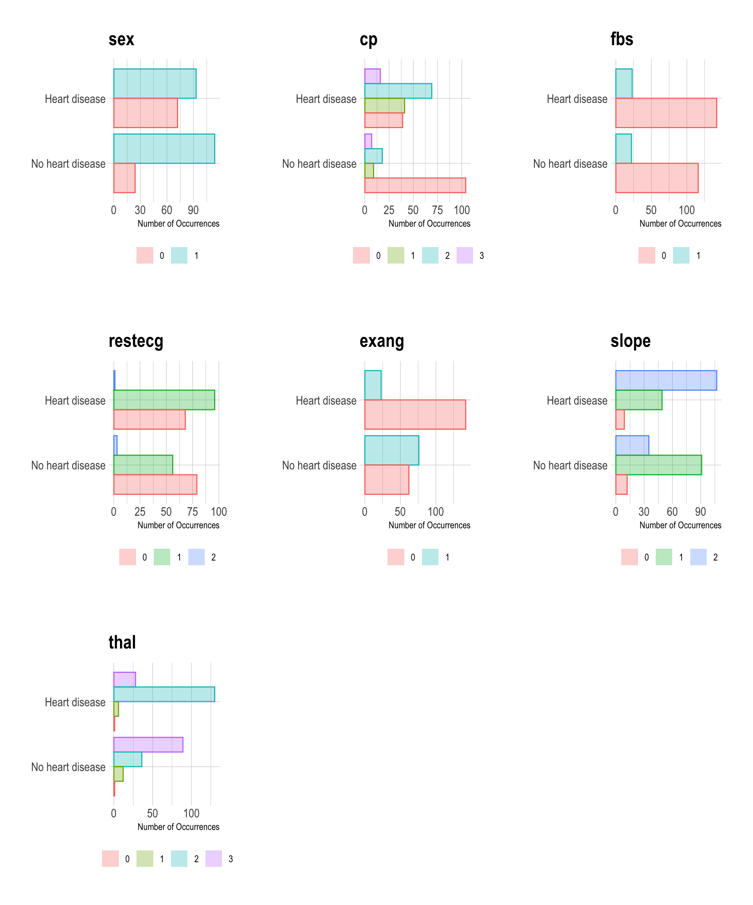
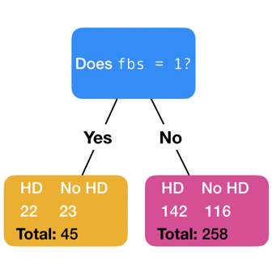

Heart Disease Classification
================
Jamie Hargreaves

## Loading the data

For this project we’re going to use a [dataset taken from
Kaggle](https://www.kaggle.com/ronitf/heart-disease-uci) which contains
the attributes of patients admitted to hospital with suspected heart
problems, along with a flag indicating whether or not the patient
ultimately received a diagnosis of heart disease. We’ll start by reading
the data:

``` r
library(tidyverse)

# get data 
data <- read_csv("heart.csv")
```

## Exploratory analysis

Let’s look at the data quality and variable types:

``` r
# check the type of each column and for the number of NAs
tibble(
  colnames(data),
  map_chr(
    1:ncol(data),
    function(x){
      data[[x]] %>% typeof()
    }
  ),
  map_int(
    1:ncol(data),
    function(x){
      is.na(data[[x]]) %>% sum()
    }
  )
)
```

    ## # A tibble: 14 x 3
    ##    `colnames(data)` `map_chr(...)` `map_int(...)`
    ##    <chr>            <chr>                   <int>
    ##  1 age              double                      0
    ##  2 sex              double                      0
    ##  3 cp               double                      0
    ##  4 trestbps         double                      0
    ##  5 chol             double                      0
    ##  6 fbs              double                      0
    ##  7 restecg          double                      0
    ##  8 thalach          double                      0
    ##  9 exang            double                      0
    ## 10 oldpeak          double                      0
    ## 11 slope            double                      0
    ## 12 ca               double                      0
    ## 13 thal             double                      0
    ## 14 target           double                      0

``` r
# get number of observations
nrow(data)
```

    ## [1] 303

We can see that each of the 14 variables are numeric and that we have no
missing values in any of the 303 observations. Whilst all of the
variables have been identified as numeric, this doesn’t really make
sense since a number are actually integer representations of categorical
variables, for example, the chest pain type `cp` can take values of `0`,
`1`, `2` or `3`, but a value of say `2.6` doesn’t really mean anything.
We therefore need to convert variables like this to categorical
variables:

``` r
library(magrittr)

# convert relevant variables to characters
data %<>%
  mutate(
    sex = as.character(sex),
    cp = as.character(cp),
    fbs = as.character(fbs),
    restecg = as.character(restecg),
    exang = as.character(exang),
    slope = as.character(slope),
    thal = as.character(thal),
    target = as.character(target)
  )
```

### Continuous variables

We’ll begin our analysis by looking at the continuous variables in the
data, starting with their distribution:

``` r
library(hrbrthemes)
library(gridExtra)

# histograms
histograms <- map(
  data %>%
    select_if(is.numeric) %>%
    colnames(),
  function(x){
    data %>%
      ggplot(aes(x = !!as.name(x), y = ..density..)) + 
      geom_histogram(colour = "#00BFC4", fill = "white") + 
      geom_density(colour = "#00BFC4", fill = "#00BFC4", alpha = 0.2) + 
      labs(
        y = "Density",
        title = x
      ) + 
      theme_ipsum()
  }
)

#plot
do.call(grid.arrange, histograms)
```


From the plots we can see that:

  - Patients in the sample population are most likely to be in their
    late 50s, though we can also see a smaller peak in the density curve
    in the mid-40s and in general ages range anywhere between very late
    20s to late 70s;

  - The resting blood pressure `trestbps` of patients has a peak around
    `130`, though from the histogram we can see some large groupings
    interspersed between `100` and `140`, followed by a fairly swift
    drop;

  - The distributions for both cholesterol `chol` and maximum heart rate
    `thalach` look to be fairly smooth with peaks around `240` and
    `160`, respectively;

  - The histogram for ST depression `oldpeak` (a measurement taken from
    an electrocardiogram), is heavily concentrated at `0`, though has a
    fairly wide range; and

  - Finally, the number of major vessels looks to actually be a
    categorical variable despite the fact that we’ve treated is as
    numeric, however a number of papers
    ([here](http://csjournals.com/IJCSC/PDF7-1/18.%20Tejpal.pdf), for
    example), are clear that this variable should be treated as
    continuous so we’ll follow that convention. It’s worth noting also
    that numerous papers describe this variable as taking values between
    `0` and `3` in the data set, however we can see a small number of
    instances where `ca = 4`. Given that the varibale is taken to be
    numeric, this isn’t necessarily a problem so we’ll leave these
    observations as they are since it’s not immediately obvious what the
    sensible way to replace instances of `ca = 4` would be and, given
    that we only have `303` observations, we don’t want to lose data if
    we can avoid it.

We can use box plots to look at the difference in the these numeric
variables when we split the population based on `sex`:

``` r
# boxplots
box_plots <- map(
  map_chr(
  1:ncol(data),
  function(x){
    ifelse(
      is.numeric(data[[x]]),
      names(data[, x]),
      FALSE
    )
  }
) %>%
  as_tibble() %>%
  filter(value != FALSE) %>%
  pull(),
  function(x){
    data %>%
      ggplot(aes(x = sex, y = !!as.name(x), colour = sex)) + 
      geom_boxplot(alpha = 0.3, show.legend = FALSE) + 
      geom_jitter(alpha = 0.1, show.legend = FALSE) + 
      coord_flip() +
      scale_x_discrete(label = c("Female", "Male")) + 
      labs(
        x = NULL,
        title = x
      ) +
      theme_ipsum()
  }
)

#plot
do.call(grid.arrange, box_plots)
```



We can see from the box plots that overall there is little difference
between male and female patients in the population. The median age of
females is slightly higher than males, as is the cholosterol level and
maximum heartrate, whilst the ST depression is slightly lower. Whilst
the difference might not be large in magnitude, we can check if the
differences are statistically significant, i.e. whether we’re likely to
observe them in a world where there really was no difference. How we do
that depends on the distributions of the variables, if they’re normally
distributed then we can use an unpaired two-samples t-test, whereas if
the variables are non-normally distributed, then we’ll use a two-samples
Wilcoxon rank test. We therefore need to check for normality in each
variable split between male and female
subsets:

``` r
# Shapiro-Wilk test for normality, p > 0.05 ==> data normally distributed
num_vars <- data %>%
  select_if(is.numeric) %>%
  names()

data %>%
  group_by(sex) %>%
  group_split() %>%
  map_df(
    function(x){
      tibble(
        sex = unlist(rep(distinct(x[, "sex"]), length(num_vars))),
        var = num_vars,
        p.value = map_dbl(
          num_vars,
          function(y){
            shapiro.test(x[[y]])$p.value
          }
        ),
        is.normal = ifelse(p.value > 0.05, "yes", "no")
      )
    }
  )
```

    ## # A tibble: 12 x 4
    ##    sex   var       p.value is.normal
    ##    <chr> <chr>       <dbl> <chr>    
    ##  1 0     age      1.39e- 1 yes      
    ##  2 0     trestbps 6.32e- 3 no       
    ##  3 0     chol     3.02e- 5 no       
    ##  4 0     thalach  4.75e- 4 no       
    ##  5 0     oldpeak  7.89e-11 no       
    ##  6 0     ca       1.45e-13 no       
    ##  7 1     age      4.00e- 2 no       
    ##  8 1     trestbps 1.07e- 4 no       
    ##  9 1     chol     5.27e- 1 yes      
    ## 10 1     thalach  8.71e- 3 no       
    ## 11 1     oldpeak  1.90e-12 no       
    ## 12 1     ca       2.41e-17 no

Whilst two of the variables (female `age` and male `chol`) are normally
distributed, those same variables are non-normally distributed for the
opposite sex and the other variables in the data set are also
non-normally distributed, so we’ll opt for the two-samples Wilcoxon rank
test:

``` r
# calculate the Wilcoxon test statistic, p > 0.05 ==> insignificant
tibble(
  var = num_vars,
  p.value = map_dbl(
    num_vars,
    function(x){
     wilcox.test(as.formula(paste0(x, "~ sex")), data = data)$p.value
    }
  ),
  is.sig = ifelse(p.value < 0.05, "yes", "no")
)
```

    ## # A tibble: 6 x 3
    ##   var      p.value is.sig
    ##   <chr>      <dbl> <chr> 
    ## 1 age      0.0851  no    
    ## 2 trestbps 0.358   no    
    ## 3 chol     0.00856 yes   
    ## 4 thalach  0.489   no    
    ## 5 oldpeak  0.0802  no    
    ## 6 ca       0.0381  yes

We can see that the difference in median cholesterol `chol` and median
number of major vessels `ca` for males and females is significant,
whilst the differences between the remaining medians aren’t
statistically significant.

It’d be interesting to understand how these variables correlate with the
`target` variable which indicates whether or not a patient had heart
disease (`0` indicating no heart disease and `1` indicating heart
disease), and we can do this by calculating the point-biserial
correlation coefficients:

``` r
# numerical variables
num_vars <- data %>%
  select_if(is.numeric)

# plot the correlation
tibble(
  var = names(num_vars),
  corr = map_dbl(
    1:ncol(num_vars),
    function(x){
      cor.test(as.numeric(data$target), num_vars[[x]])$estimate
    }
  ),
  is.sig = map_dbl(
    1:ncol(num_vars),
    function(x){
      ifelse(
        cor.test(as.numeric(data$target), num_vars[[x]])$p.value < 0.05,
        1,
        0
      )
    }
  )
) %>%
  ggplot(aes(x = var, y = corr, fill = factor(is.sig, levels = c(0,1), 
                                              label = c("No", "Yes")), 
                                              colour = ..fill..)) +
  geom_col(alpha = 0.3) + 
  coord_flip() + 
  scale_fill_discrete(name = "Is significant?") + 
  scale_color_discrete(guide = FALSE) + 
  xlab(NULL) + 
  ylab("Correlation coefficient") + 
  theme_ipsum()
```



We can see that all the correlations are significant (i.e. have a
*p*-value less than 5%), except for the correlation with cholesterol,
however this is a weak correlation regardless. In fact in general the
correlations are mostly weak, though there are moderate correlations (~
0.4 in absolute value), with both the maximum heartrate `thalach` and
the ST depression `oldpeak`. We can interpret this to mean that moving
from a diagnosis of “does not have heart disease” to “has heart disease”
is typically associated with an increase in maximum heartrate and a
decrease in ST depression.

### Categorical variables

We’ve done some analysis of the numeric variables in the data set, so
now let’s move on to looking at the categorical variables. A key first
question is how skewed is our data set towards either people with heart
disease or those without?

``` r
# plot 
data %>%
  group_by(target) %>%
  summarise(count = n()) %>%
  mutate(per = str_c(round(100 * count / sum(count), 1), "%")) %>%
  ggplot(aes(x = factor(target, levels = c(0,1), label = c("No heart disease", "Heart disease")), 
             y = count, label = per)) + 
  geom_col(colour = "#00BFC4", fill = "#00BFC4", alpha = 0.3, width = 0.5) + 
  geom_text(hjust = -0.2) + 
  coord_flip(clip = "off") + 
  xlab(NULL) + 
  ylab("Number of Occurrences") +
  theme_ipsum()
```


From the above plot, we can see that there are slightly more patients
with heart disease than without, though the data set isn’t massively
skewed, with only a 9% difference. Similarly, we can look at the
proportion of patients in each of a variable’s categories for heart
disease vs. no heart disease:

``` r
# get the categorical variables
cat_vars <- data %>%
  select_if(is.character) %>%
  select(-one_of("target"))

# plots
cat_plots <- map(
  names(cat_vars),
  function(x){
    data %>%
      group_by(target, !!as.name(x)) %>%
      summarise(count = n()) %>%
      ggplot(aes(x = factor(target, levels = c(0,1), 
                            label = c("No heart disease", "Heart disease")), 
                            y = count, fill = !!as.name(x), 
                            colour = ..fill..)) + 
      geom_col(position = "dodge", alpha = 0.3) + 
      coord_flip() + 
      scale_fill_discrete(name = NULL) +
      scale_color_discrete(guide = FALSE) + 
      labs(
        x = NULL,
        title = x
      ) +
      ylab("Number of Occurrences") + 
      theme_ipsum() + 
      theme(legend.position = "bottom")
  }
)

# print
do.call(grid.arrange, cat_plots)
```



A number of things stand out from the plots above:

  - There is a similar proportion of men in both subsets of patients,
    but a much larger proportion of women with heart disease than
    without;

  - There is a clear difference between the types of chest pain
    experienced by those with and without heart disease. Patients
    without heart disease primarily experience typical angina, whilst
    those with heart disease predomninantly experience nonanginal pain,
    as well atypical angina, closely followed by typical angina (see
    [here](https://www.ncbi.nlm.nih.gov/pmc/articles/PMC4468223/) for
    reference to the types of chest pain measured in this data set);

  - There is almost no difference in the blood sugar levels of patients
    with and without heart disease;

  - The proportion of patients with normal ECG results decreases and the
    proportion with abnormal ECG results increases between patients
    without heart disease and patients with heart disease;

  - The proportion of patients without exercise induced angina is
    noticeably higher in patients with heart disease;

  - For patients without heart disease, the slope of the ST curve peak
    is predominantly flat, whilst for those with heart disease, the
    curve peak is predominantly downward-sloping; and

  - Finaly, patients with heart disease primarily display a fixed
    abnormality in the Thallium-201 stress scintigraphy test, whilst
    those without heart disease typically display a reversible
    abnormality.

It’s also noticeable that there looks to be at least one instance in
both the “no heart disease” and “heart disease” subsets where `thal
= 0`. The `thal` variable is only defined for values `1`, `2` and `3`
which means we’ve actually got some missing values, so before we carry
on we’ll identify those and replace them.

``` r
# count the number of observations in each level
data %>%
  group_by(thal) %>%
  summarise(n()) 
```

    ## # A tibble: 4 x 2
    ##   thal  `n()`
    ##   <chr> <int>
    ## 1 0         2
    ## 2 1        18
    ## 3 2       166
    ## 4 3       117

As we thought, there are only two instances where `thal = 0`. To replace
them, we’ll take the most frequent value for patients with and without
heart disease, since we already saw from the plots that one of the
missing values occurs in the subset of patients with heart disease and
the other occurs in the subset without.

``` r
# get most frequent level in each group
data %>%
  group_by(target, thal) %>%
  summarise(n())
```

    ## # A tibble: 8 x 3
    ## # Groups:   target [2]
    ##   target thal  `n()`
    ##   <chr>  <chr> <int>
    ## 1 0      0         1
    ## 2 0      1        12
    ## 3 0      2        36
    ## 4 0      3        89
    ## 5 1      0         1
    ## 6 1      1         6
    ## 7 1      2       130
    ## 8 1      3        28

We can see that for patients without heart disease, the most frequent
`thal` category is `3`, whilst for patients with heart disease the most
frequent category is `2`.

``` r
# update missing values 
data %<>%
  mutate(
    thal = ifelse(
      target == "0" & thal == "0",
      "3",
      ifelse(
        target == "1" & thal == "0",
        "2",
        thal
      )
    )
  )
```

Now that we’ve looked at both the continuous and categorical variables,
we have a better understanding of the data and can move on to modelling.

## Training a model

To create a model we’ll randomly partition the data into train and test
sets, allocating  of the data to train, then train a model using repeated
-fold cross validation.
Under cross validation, we take the training set and randomly partition
it into  equally sized
folds (or groups). We then select one fold to use as a validation set
and train a model on the remaining
 folds. We repeat
the process, each time using a different fold as a validation set so
that in total each fold is used once as a validation set and
 times as a
training set. After this, we end up with a total of
 models and calculate
the cross validated error by taking the average over the errors of each
individual model which provides us with an estimate of the true error.
Since we’re using *repeated* -fold cross validation, we then repeat the process
 times and take the
final cross validated error to be the average of each of the individual
cross validated errors - we’ll take  and
. This
then gives us a robust way to compare the accuracy of different types of
models.

### Multiple logistic regression

We’ve now got our data set in a format that’s suitable for modelling.
This is a binary classification problem since, given the set of patient
attributes, we want to answer the question “does the patient have heart
disease?”. One of the simplest methods for classification (and the one
we’ll try first), is multiple logistic regression, so let’s talk a
little about how it works.

With a typical regression model we’re trying to predict the value of a
continuous response variable, for example, a person’s salary given their
age and the number of years they spent in higher education. In this case
it’s completely reasonable get a prediction of say `27,836.89`. However,
for the same reason that we encoded some of the variables in the data
set as factors previously, it makes no sense if our model were to
predict a value of `0.768` in response to the question of whether or not
a person has heart disease - they either do or they don’t.

With multiple logistic regression, rather than predicting a `0` or a
`1`, we predict the probability that an observation belongs to one of
the categories. We could use multiple linear regression to model this
probability, but this approach suffers from the fact that we could
return probabilities that were either less than `0` or greater than `1`,
and these probabilities would be essentially meangingless. Multiple
logistic regression avoids this problem by constraining all predictions
to the interval
![\[0,1\]](https://latex.codecogs.com/png.latex?%5B0%2C1%5D "[0,1]") by
modelling the probaility using the logistic function

  
 = \\frac{e^{\\beta_0 + \\beta_1\\textbf{X}}}{1 + e^{\\beta_0 + \\beta_1\\textbf{X}}},")  

where ") is the vector of
 predictors. We’ll use
the `caret` library and the function we wrote above to train a multiple
logistic regression model. In general if we don’t have any domain
knowledge which suggests that all the features in our data set should be
important in our model, then we might want to find an optimal feature
set, but since we have good reason to believe that each of the features
in the data set are indicators of heart disease, we’ll proceed to use
them all.

``` r
library(caret)
set.seed(100)

# split the data into test and train, with 70% train
train_index <- createDataPartition(data$target, p = 0.7, list = FALSE)
train_data <- data[train_index, ]
test_data <- data[-train_index, ]

# repeated k-fold cross validation
ctrl <- trainControl(method = "repeatedcv", number = 10, repeats = 5)  

# train the model
model_log <- train(
  target ~ .,
  data = train_data,
  method = "glm",
  family = "binomial",
  trControl = ctrl
)

# check the accuracy
model_log
```

    ## Generalized Linear Model 
    ## 
    ## 213 samples
    ##  13 predictor
    ##   2 classes: '0', '1' 
    ## 
    ## No pre-processing
    ## Resampling: Cross-Validated (10 fold, repeated 5 times) 
    ## Summary of sample sizes: 192, 191, 191, 192, 192, 192, ... 
    ## Resampling results:
    ## 
    ##   Accuracy   Kappa    
    ##   0.8359524  0.6687658

We can see from the above results that the multiple logistic regression
model has an accuracy of roughly 84% which is impressive for such a
simple model\! The model has also returned a `Kappa` value of roughly
`0.67` - this is Cohen’s kappa which essentially gives a measure of the
model accuracy taking into account the likelihood that the model
could’ve classified some observations correctly by chance. Let’s see
which of the features were most influential by looking at the variable
importance scores:

``` r
# get variable importance scores
var_imp <- varImp(model_log)$importance

# plot
tibble(
  var = rownames(var_imp),
  score = var_imp$Overall
) %>%
  ggplot(aes(x = reorder(var, score), y = score)) + 
  geom_col(colour = "#00BFC4", fill = "#00BFC4", alpha = 0.3, width = 0.8) + 
  coord_flip() + 
  xlab(NULL) +
  ylab("Variable Importance Score") + 
  theme_ipsum()
```


The most influential predictor in the model is whether or not the
patient experienced nonanginal pain, closely followed by whether or not
the patient experienced atypical angina, and this ties back to the
visualisations we saw previously which showed the proportions of each
chest pain type experienced by each subset of patients (heart disease or
no heart disease). This is followed by the number of major vessels `ca`,
after which things gradually start to drop off. It’s also noticeable
that whether or not the patient was male looks to be a fairly important
predictor and this is sensible since again we saw in the visualisation
that there were significantly more male patients in the “no heart
disease” subset than female.

### Decision tree

Next we’re going to use a decision tree to classify patients. Unlike the
multiple logistic regression model we used previously, the decision tree
classifier directly assigns each observation to a specific class, rather
than assigning a probability.

A decision tree works by posing an initial binary question about the
data in the root node, then based on the response, splits the data into
one of two new nodes. At each node, this binary splitting occurs until
eventually (according to some stopping criteria, e.g. maximum tree
depth), we reach a terminal node, at which point our prediction is the
most common classification of the observations in the remaining subset
of the data in that node.

To select the predictor on which the first split should be made, we
compare how well each of the features splits the data using a quantity
known as the *Gini index* which gives us a measure of the impurity of a
node. A Gini index of `0` would indicate a completely pure node and
would mean that the node was made up only a single class. The best
predictor for a given node is the predictor that results in the node
with the lowest Gini index.

For example, if we were trying to determine which feature to use in the
root node of the tree, we could take the `fbs` variable and imagine our
node poses the question “does `fbs = 1`?”. To determine the Gini index
of the node, we look at how `fbs` splits the data:

``` r
# look at the split
data %>%
  group_by(fbs, target) %>%
  summarise(n())
```

    ## # A tibble: 4 x 3
    ## # Groups:   fbs [2]
    ##   fbs   target `n()`
    ##   <chr> <chr>  <int>
    ## 1 0     0        116
    ## 2 0     1        142
    ## 3 1     0         22
    ## 4 1     1         23

The first branch from the node would be the “yes” response - we can see
from the table above that when `fbs = 1`, we have a total of `45`
patients, `23` with heart disease and `22` without. Similarly, in the
“no” branch we can see a total of `258` patients, `142` with heart
disease and `116` without. The Gini scores for the nodes are given by:

``` r
# first node
gini_1 <- 1 - (23 / (23 + 22))^2 - (22 / (23 + 22))^2

# second node
gini_2 <- 1 - (116 / (116 + 142))^2 - (142 / (116 + 142))^2

# overall 
gini_overall <- (45 / (45 + 258)) * gini_1 + (258 / (45 + 258)) * gini_2
gini_overall
```

    ## [1] 0.4956396

The overall Gini index for the `fbs` (the weighted averages of the two
nodes), is therefore `0.496` and we would compare this to the Gini index
of each of the other predictors to determine whether or not `fbs`
resulted in the purest node possible. This approach to splitting is
called *greedy* because at any step, we’re only looking at which feature
gives the best split there and then, rather than trying to work out
which feature gives the best over tree further down the line.

Let’s train our tree:

``` r
set.seed(100)

# train the model
model_tree <- train(
  x = train_data[, -which(names(train_data) %in% "target")],
  y = train_data$target,
  method = "rpart",
  trControl = ctrl
)

# check the accuracy
model_tree
```

    ## CART 
    ## 
    ## 213 samples
    ##  13 predictor
    ##   2 classes: '0', '1' 
    ## 
    ## No pre-processing
    ## Resampling: Cross-Validated (10 fold, repeated 5 times) 
    ## Summary of sample sizes: 191, 191, 191, 191, 193, 193, ... 
    ## Resampling results across tuning parameters:
    ## 
    ##   cp          Accuracy   Kappa    
    ##   0.01546392  0.7628831  0.5203895
    ##   0.04123711  0.7376190  0.4701111
    ##   0.52577320  0.6319913  0.2233102
    ## 
    ## Accuracy was used to select the optimal model using the largest value.
    ## The final value used for the model was cp = 0.01546392.

Again, despite such a relatively simple model, we’ve managed to achieve
an accuracy of approximately 76%. Whilst this is lower than the 84%
accuracy we were able to achieve from the multiple logistic regression
model (a decrease of around 10%), as we’ll see further down, the
decision tree approach benefits from significantly greater
interpretability, not least because we can easily visualise the train of
logic that geos into a classification, and this shouldn’t be
underestimated, especially for a problem like this where one of the key
interests may actually be gaining an understanding of the driving
factors behind heart disease as opposed to raw predictive power.

``` r
library(rattle)

# visualise the decision tree
fancyRpartPlot(model_tree$finalModel, sub = "")
```



We can see from the visualisation of the final decision tree that
`thal`, `cp`, `oldpeak` and `thalach` are the only predictors considered
when classifying the patient. This isn’t totally desimilar to the top
features selected using the multiple logistic regression model, though
our tree hasn’t used the number of major vessels `ca`. We can see that
85% of patients with a fixed defect, `thal = 2`, were categorised has
having heart disease, though the ST depression `oldpeak` is a necessary
differentiator. Similarly, 74% of patients with either normal or
reversible defects, `thal = 1` or `thal = 3`, are ultimately categorised
as not having heart disease, though here two additional categories are
necessary.
